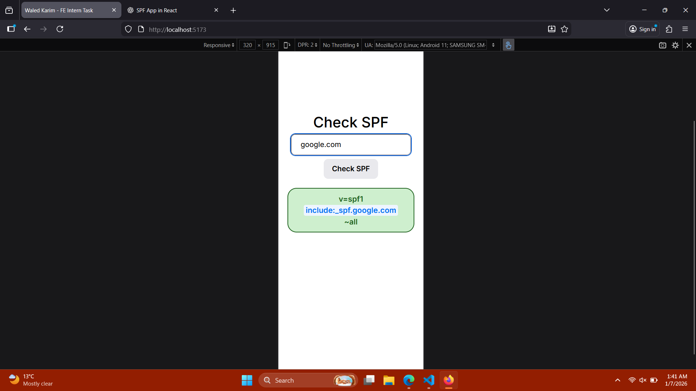
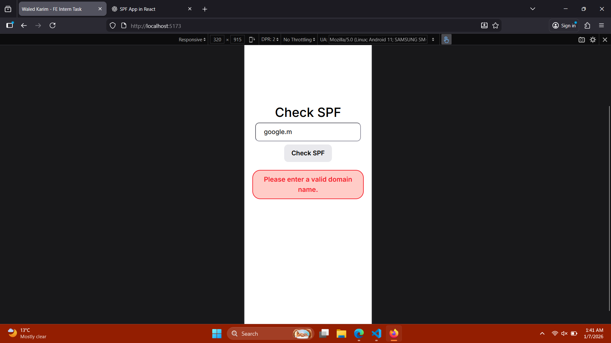

# SPF Checker (Frontend Intern Task)

A simple React-based single-page application (SPA) that allows users to check the SPF (Sender Policy Framework) records of a domain. The app performs a DNS TXT lookup, extracts SPF records, and displays them in a clean, readable format.

---

## ✨ Features

- Enter a domain name (e.g. `spotify.com`)
- Fetch DNS TXT records using DNS-over-HTTPS
- Display all SPF records (`v=spf1`)
- Highlight important SPF mechanisms:
  - `include:`
  - `redirect=`
- Handle edge cases gracefully:
  - Invalid domain input
  - Domains with no SPF record
  - Network or lookup errors
- Responsive UI with proper handling of long SPF strings
- Loading indicator while fetching data

---

## 🛠️ Tech Stack

- **React**
- **Vite**
- **JavaScript**
- **CSS**
- **Google DNS over HTTPS API**

---

## 🚀 How to Run the Project Locally

### 1. Clone the repository

```bash
git clone https://github.com/waledkarim/spf_checker.git
cd spf-checker
```

### 2. Install dependencies

```bash
npm install
```

### 3. Start the development server

```bash
npm run dev
```

---

## ⚠️ Assumptions & Limitations

- The app only reads and displays SPF records; it does not validate or expand included domains.
- SPF records are displayed as returned by DNS and are not modified.

## Screenshots



